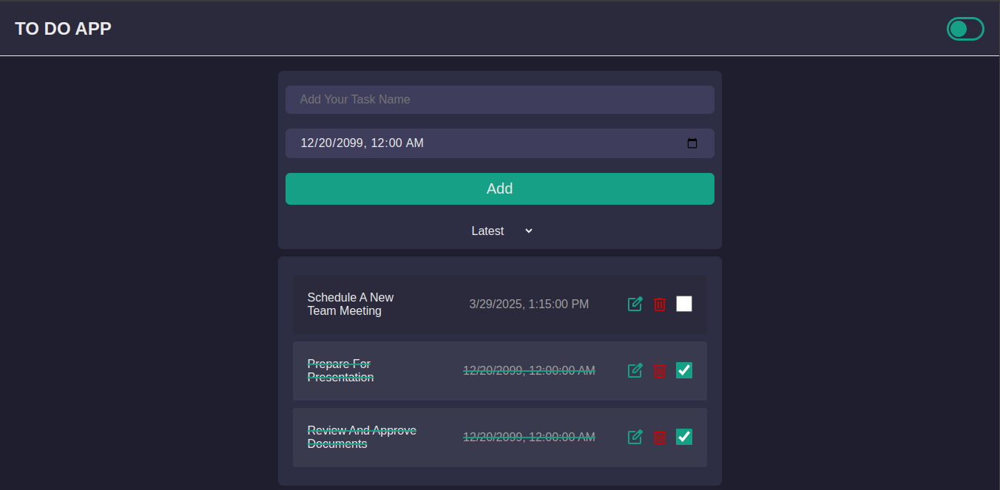
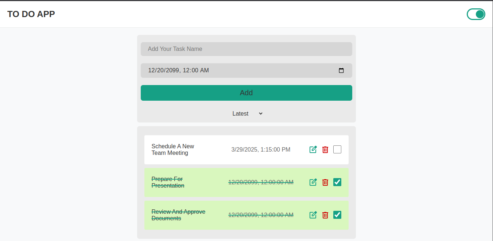
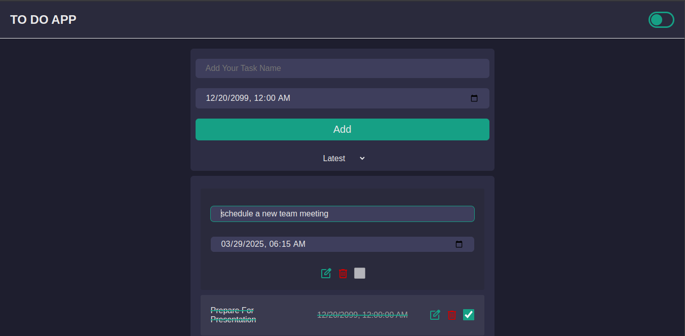
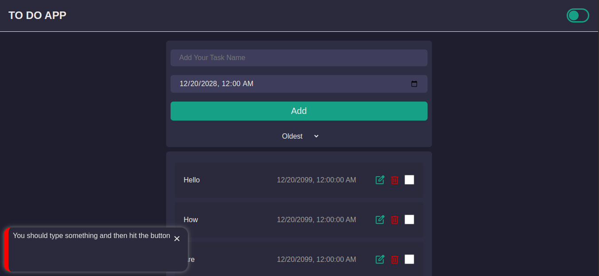
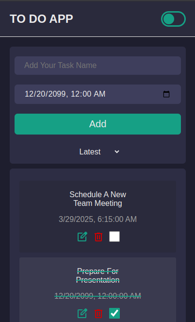
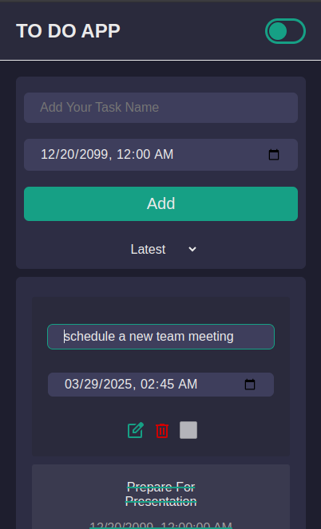

# ✅ To-Do List App

A responsive, interactive, and clean **To-Do List App** to help you manage your daily tasks efficiently. Packed with essential features like drag-and-drop reordering, reminders, dark mode, and mobile-friendly design — it’s built for ease and comfort on any device.

---

## 👀 Preview

---

## ✨ Features

-   ✅ **Mark Tasks as Done**  
    Easily check off completed tasks.

-   🔃 **Reorder Tasks with Drag and Drop**  
    Organize your task list with smooth drag-and-drop support.

-   ⏰ **Set Reminders for Tasks**  
    Get reminded before your task is due.

-   ➕ **Add Tasks**
-   🗑️ **Delete Tasks**
-   ✏️ **Edit Tasks**  
    Fully manage your tasks from creation to completion.

-   📅 **Sort Tasks**  
    Toggle between latest-added (default) and deadline-based sorting.

-   🌙 **Dark Theme Toggle**  
    Switch between light and dark mode for better eye comfort.

-   💾 **Session-Based Storage**  
    Data is stored temporarily using `sessionStorage` and cleared automatically when the browser is closed — keeping storage usage minimal.

-   📱 **Responsive Design**  
    The app is fully responsive and works smoothly on desktops, tablets, and mobile devices.

---

## 🧠 Code Notes

-   Code is clean and well-commented for easy understanding.
-   Sections are logically organized for maintainability and customization.

---

## 🚀 Getting Started

1. **Clone or Download** this repository.
2. Open `index.html` in your browser.
3. Start managing your tasks!

---

## ⚙️ Tech Stack

-   HTML, CSS, JavaScript
-   Drag and drop API
-   CSS variables for theme switching
-   `sessionStorage` for data handling

---

## 📌 Important Notes

-   Data is not saved between sessions due to the use of sessionStorage. If you'd like to preserve data even after closing the browser, you can easily switch from sessionStorage to localStorage by replacing the relevant API calls in the code.

---

## 📄 License

This project is open for use, learning, and modification. No attribution required — enjoy building!

-Hassan Hajizadeh
